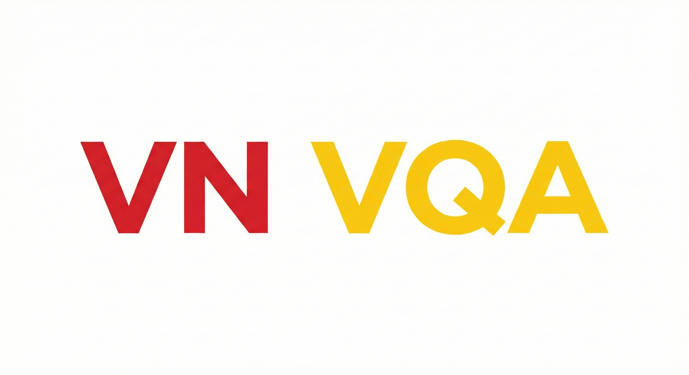

# Awesome-Vietnamese-VQA
A curated list of datasets, papers, models, and resources for **Vietnamese Visual Question Answering (VQA)**, covering traditional VQA, Text-VQA/OCR-VQA, document understanding, and multimodal reasoning.

## Table of Contents
- [Datasets](#datasets)
- [Papers](#papers)
- [Resources](#resources)
- [Contributing](#contributing)

---

## Datasets

### 📄 Text-VQA / OCR-VQA (Scene Text & Documents)

- **[CVPR 2026]** *SEA-Vision: A Multilingual Benchmark for Comprehensive Document and Scene Text Understanding in Southeast Asia* [[Paper](https://arxiv.org/abs/2603.15409)]

- **[Zenodo 2026]** *ViChartVQA-Dataset: A Cost-Efficient AI-Generated Vietnamese Chart Visual Question Answering Dataset* [[Data](https://doi.org/10.5281/zenodo.20434862)]

- **[ACIIDS 2025]** *A Southeast Asian Language OCR Dataset and Evaluation for Large Multimodal Models* [[Paper](https://doi.org/10.1007/978-981-95-3346-6_7)]

- **[AAAIW 2026]** *ViInfographicVQA: A Benchmark for Single and Multi-image Visual Question Answering on Vietnamese Infographics* [[Paper](https://arxiv.org/abs/2512.12424)]

- **[KSE 2025]** *Data Generation Based on Multimodal Language Models for Vietnamese Visual Question Answering* [[Paper](https://ieeexplore.ieee.org/abstract/document/11309604)]

- **[IJDAR 2025]** *LiGT: Layout-infused Generative Transformer for Visual Question Answering on Vietnamese Receipts* [[Paper](https://arxiv.org/abs/2502.19202)]

- **[arXiv 2025]** *Towards Signboard-Oriented Visual Question Answering: ViSignVQA Dataset, Method and Benchmark* [[Paper](https://arxiv.org/pdf/2512.22218)]

- **[ESWA 2025]** *ViTextVQA: A Large-scale Visual Question Answering Dataset and a Novel Multimodal Feature Fusion Method for Vietnamese Text Comprehension in Images* [[Paper](https://www.sciencedirect.com/science/article/abs/pii/S0957417425044549)]

- **[Multimedia Syst. 2025]** *ViOCRVQA: A Novel Benchmark Dataset and VisionReader for Visual Question Answering by Understanding Vietnamese Text in Images* [[Paper](https://link.springer.com/article/10.1007/s00530-025-01696-7)]

- **[RIVF 2024]** *LawViVQA: A Visual Question Answering Dataset for Vietnamese Legal Content* [[Paper](https://ieeexplore.ieee.org/abstract/document/11009025)]

- **[Inf. Fusion 2023]** *OpenViVQA: Task, Dataset, and Multimodal Fusion Models for Visual Question Answering in Vietnamese* [[Paper](https://www.sciencedirect.com/science/article/abs/pii/S1566253523001847)]

---

### 🖼️ General VQA & Visual Reasoning (Non-OCR)

- **[CCIS 2026]** *AutoViVQA: A Large-Scale Automatically Constructed Dataset for Vietnamese Visual Question Answering* [[Paper](https://doi.org/10.1007/978-981-92-0068-9_33)] [[arXiv](https://arxiv.org/abs/2603.09689)] [[Code](https://github.com/ntienhuy/AutoViVQA)]

- **[CCIS 2026]** *VietMed-VQA: A Novel Dataset and Benchmark for Vietnamese Medical Visual Question Answering* [[Paper](https://doi.org/10.1007/978-981-92-2600-9_29)]

- **[SSRN 2026]** *A Semi-automatic Methodology for Generating the VietTravelVQA Dataset with Multi-level Difficulty Annotations* [[Paper](https://doi.org/10.2139/ssrn.6797660)] [[Data](https://doi.org/10.17632/fvxtpnh8mh.2)]

- **[arXiv 2026]** *VMMU: A Vietnamese Multitask Multimodal Understanding and Reasoning Benchmark* [[Paper](https://arxiv.org/pdf/2508.13680v3)]

- **[VLSP 2025]** *VLSP 2025 MLQA-TSR Challenge: Vietnamese Multimodal Legal Question Answering on Traffic Sign Regulation* [[Paper](https://aclanthology.org/2025.vlsp-1.48/)]

- **[TNU JST 2025]** *EViQA: A Multi-disciplinary Visual Question Answering Dataset for Educational Textbooks in Vietnam* [[Paper](https://vjol.info.vn/tnu/en/article/view/194301/)]

- **[arXiv 2025]** *Rice-VL: Evaluating Vision-Language Models for Cultural Understanding Across ASEAN Countries* [[Paper](https://arxiv.org/abs/2512.01419)]

- **[arXiv 2025]** *Toward a Vision-Language Foundation Model for Medical Data: Multimodal Dataset and Benchmarks for Vietnamese PET/CT Report Generation* [[Paper](https://arxiv.org/abs/2509.24739)]

- **[arXiv 2025]** *VinDr-CXR-VQA: A Visual Question Answering Dataset for Explainable Chest X-Ray Analysis with Multi-Task Learning* [[Paper](https://arxiv.org/abs/2511.00504)] [[Data](https://huggingface.co/datasets/Dangindev/VinDR-CXR-VQA)]

- **[arXiv 2025]** *VietMEAgent: Culturally-Aware Few-Shot Multimodal Explanation for Vietnamese Visual Question Answering* [[Paper](https://arxiv.org/abs/2511.09058)]

- **[MIWAI 2025]** *ViPPS: Building a Multimodal Dataset for Physics Problem Solving in Vietnamese* [[Paper](https://link.springer.com/chapter/10.1007/978-981-95-4960-3_25)]

- **[ICISN 2025]** *An Automated Pipeline for Constructing a Vietnamese VQA-NLE Dataset* [[Paper](https://link.springer.com/chapter/10.1007/978-981-95-1746-6_18)]

- **[ALVR @ ACL 2024]** *SEA-VQA: Southeast Asian Cultural Context Dataset for Visual Question Answering* [[Paper](https://aclanthology.org/2024.alvr-1.15/)]

- **[Multimedia Syst. 2024]** *ViCLEVR: A Visual Reasoning Dataset and Hybrid Multimodal Fusion Model for Visual Question Answering in Vietnamese* [[Paper](https://link.springer.com/article/10.1007/s00530-024-01394-w)]

- **[VLSP 2022]** *EVJVQA Challenge: Multilingual Visual Question Answering* [[Paper](https://arxiv.org/abs/2302.11752)]

- **[PACLIC 2021]** *ViVQA: Vietnamese Visual Question Answering* [[Paper](https://aclanthology.org/2021.paclic-1.72/)] [[Code](https://github.com/kh4nh12/ViVQA)]
  
### 🖼️💬 Image Captioning

- **[arXiv 2026]** *Linguistically Informed Multimodal Fusion for Vietnamese Scene-Text Image Captioning: Dataset, Graph Framework, and Phonological Attention* [[Paper](https://arxiv.org/abs/2604.27712)]

- **[Signal Process. Image Commun. 2025]** *UIT-OpenViIC: An Open-domain Benchmark for Evaluating Image Captioning in Vietnamese* [[Paper](https://www.sciencedirect.com/science/article/abs/pii/S0923596525001766)] [[arXiv](https://arxiv.org/abs/2305.04166)]

- **[arXiv 2024]** *KTVIC: A Vietnamese Image Captioning Dataset on the Life Domain* [[Paper](https://arxiv.org/abs/2401.08100)]

- **[VNU JCSCE 2022 / VLSP 2021]** *VLSP 2021 – vieCap4H Challenge: Automatic Image Caption Generation for Healthcare Domain in Vietnamese* [[Paper](https://doi.org/10.25073/2588-1086/vnucsce.341)] [[Task](https://vlsp.org.vn/vi/vlsp2021/eval/vieCap4H)]

- **[ICCCI 2020]** *UIT-ViIC: A Dataset for the First Evaluation on Vietnamese Image Captioning* [[Paper](https://link.springer.com/chapter/10.1007/978-3-030-63007-2_57)] [[arXiv](https://arxiv.org/abs/2002.00175)]

---

## Papers

### 📚 Surveys

- **[LNCS 2026]** *A Comprehensive Survey on Multimodal Large Language Models for Educational Visual Question Answering: Towards Vietnamese Reasoning Systems* [[Paper](https://doi.org/10.1007/978-981-92-2885-0_8)]

- **[CMC 2026]** *A Review of Vision Language Models for Architectures, Training Methods, Datasets, Evaluation Metrics, Results, and Fine-Tuning Techniques for Vietnamese* [[Paper](https://doi.org/10.32604/cmc.2026.081249)]

- **[arXiv 2025]** *A Survey on Vietnamese Document Analysis and Recognition: Challenges and Future Directions* [[Paper](https://arxiv.org/abs/2506.05061)]

---

### 📄 Text-VQA / OCR-VQA

- **[arXiv 2026]** *Direct Image-to-Modern Vietnamese Translation of Han-Nom Manuscripts via Multimodal RLHF Preference Alignment* [[Paper](https://arxiv.org/abs/2607.11434)]

- **[VLSP 2025]** *ViSemCrew: Divide and Conquer Vietnamese Semantic Parsing Through Multi-Agent Intelligence* [[Paper](https://aclanthology.org/2025.vlsp-1.33/)]

- **[ICCCI 2025]** *ViPhoVQA: Toward a Phonemic-based Method for Mitigating Rare and OOV Words in Vietnamese Text-based VQA* [[Paper](https://link.springer.com/chapter/10.1007/978-3-032-09318-9_16)]

- **[IEEE MAPR 2025]** *In Defense of Character-level Answer Generation Methods for Text-based Visual Question Answering* [[Paper](https://ieeexplore.ieee.org/abstract/document/11133907)]

- **[PACLIC 2024]** *ViConsFormer: Constituting Meaningful Phrases of Scene Texts Using Transformer-based Methods in Vietnamese Text-based VQA* [[Paper](https://aclanthology.org/2024.paclic-1.75/)]

- **[arXiv 2024]** *Vintern-1B: An Efficient Multimodal Large Language Model for Vietnamese* [[Paper](https://arxiv.org/pdf/2408.12480)]

- **[arXiv 2024]** *LaVy: Vietnamese Multimodal Large Language Model* [[Paper](https://arxiv.org/abs/2404.07922)] [[Code](https://github.com/baochi0212/LaVy)]

---

### 🖼️ General VQA (Non-OCR)

- **[CCIS 2026]** *CSMC-VQA: Dynamic Code-Switch Multimodal Curriculum Learning for Vietnamese Visual Question Answering* [[Paper](https://doi.org/10.1007/978-981-92-0068-9_37)]

- **[CCIS 2026]** *Advancing Vietnamese Visual Question Answering via Adapter-Augmented Cross-Lingual Embedding Integration* [[Paper](https://doi.org/10.1007/978-981-92-0068-9_32)]

- **[LNNS 2026]** *Vistral-V: A Lightweight and Vietnamese-Optimized Multimodal Language Model with SigLIP Vision Encoder* [[Paper](https://doi.org/10.1007/978-3-032-23297-7_19)]

- **[arXiv 2026]** *ViCLIP-OT: The First Foundation Vision-Language Model for Vietnamese Image–Text Retrieval with Optimal Transport* [[Paper](https://arxiv.org/abs/2602.22678)]

- **[IJIC 2026]** *Applying Multimodal Large Language Models for Visual Question Answering: Toward Vietnamese Educational Reasoning Systems* [[Paper](https://ijic.utm.my/index.php/ijic/article/view/680)]

- **[ICCCI 2025]** *Integrating Local Features Into Vision Transformer Architecture for Vietnamese Visual Question Answering* [[Paper](https://link.springer.com/chapter/10.1007/978-3-032-10202-7_15)]

- **[ICCVW 2025]** *Describe Anything Model for Visual Question Answering on Text-rich Images* [[Paper](https://openaccess.thecvf.com/content/ICCV2025W/VisionDocs/papers/Vu_Describe_Anything_Model_for_Visual_Question_Answering_on_Text-rich_Images_ICCVW_2025_paper.pdf)]

- **[ICCCI 2025]** *Enhancing Visual Question Answering with Semantic-Preserving Image Generation* [[Paper](https://link.springer.com/chapter/10.1007/978-3-032-10202-7_17)]

- **[VLSP 2025]** *LexiSignVQA: A Unified Training-free Multi-stage Approach to Multimodal Legal Question Answering on Traffic Sign Rules* [[Paper](https://aclanthology.org/2025.vlsp-1.52/)]

- **[VLSP 2025]** *A Hybrid Dual-Branch Retrieval and Chain-of-Thought Reasoning Framework for Multimodal Legal Question Answering* [[Paper](https://aclanthology.org/2025.vlsp-1.51/)]

- **[VLSP 2025]** *Reading the Signs: A Graph-Based System for Multimodal Information Retrieval on Vietnamese Traffic Law* [[Paper](https://aclanthology.org/2025.vlsp-1.49/)]

- **[VLSP 2025]** *Metamorphic at VLSP 2025: SIGMA – A Multimodal Agent System for Legal QA on Vietnamese Traffic Signs* [[Paper](https://aclanthology.org/2025.vlsp-1.50/)]

- **[VLSP 2025]** *A Low-cost Low-energy Approach to VQA on Traffic Signs Problems* [[Paper](https://aclanthology.org/2025.vlsp-1.53/)]

- **[VLSP 2025]** *Prompting Beyond Pixels: A Training-Free and Retrieval-Enhanced Paradigm for Traffic Question Answering* [[Paper](https://aclanthology.org/2025.vlsp-1.54/)]

- **[AAAIW 2025]** *Enhancing Vietnamese VQA through Curriculum Learning on Raw and Augmented Text Representations* [[Paper](https://arxiv.org/abs/2503.03285)]

- **[FDSE 2025]** *Vision-Based Large Language Models for Vietnamese Handwriting Recognition* [[Paper](https://link.springer.com/chapter/10.1007/978-981-95-4724-1_35)]

- **[RD-ICT 2025]** *Distillation-Centric Approaches in Visual Question Answering with Mixture of Experts* [[Paper](https://doi.org/10.32913/mic-ict-research.v2025.n2.1352)]

- **[JCC 2025]** *Integrating Features and Harnessing Pre-trained Visual-Language Models for Enhancing VQA Reading Comprehension* [[Paper](https://doi.org/10.15625/1813-9663/20525)]

- **[HCMUE JoS 2025]** *An Improved Multi-Vision Contextual Attention Model for Vietnamese Visual-Based Question Answering* [[Paper](https://journal.hcmue.edu.vn/index.php/hcmuejos/article/view/4328)]

- **[Comput. Electr. Eng. 2025]** *ExVQA: A Novel Stacked Attention Network with Extended LSTM for Visual Question Answering* [[Paper](https://www.sciencedirect.com/science/article/abs/pii/S0045790625003829)]

- **[ICCCI 2024]** *Fusing Visual and Textual Representations via Multi-layer Fusing Transformers for Vietnamese Visual Question Answering* [[Paper](https://link.springer.com/chapter/10.1007/978-3-031-70259-4_14)]

- **[JCC 2024]** *Integrating Image Features with Convolutional Sequence-to-Sequence Network for Multilingual Visual Question Answering* [[Paper](https://doi.org/10.15625/1813-9663/18155)] [[arXiv](https://arxiv.org/abs/2303.12671)]

- **[ACM TALIP 2024]** *A Novel Pretrained General-purpose Vision Language Model for the Vietnamese Language* [[Paper](https://dl.acm.org/doi/full/10.1145/3654796)]

- **[PRICAI 2024]** *Integrating Vision Tools to Enhance Visual Question Answering in Special Domains* [[Paper](https://link.springer.com/chapter/10.1007/978-981-96-0122-6_15)]

- **[CITA 2024]** *VLF-VQA: Vietnamese Lightweight Fusion Architecture for Visual Question Answering* [[Paper](https://elib.vku.udn.vn/bitstream/123456789/4011/1/P6.58-69.pdf)]

- **[ICTA 2024]** *Enhancing Visual Question Answering in Vietnamese Using Large Language Models Combined with OCR Systems* [[Paper](https://link.springer.com/chapter/10.1007/978-3-031-80943-9_34)]

- **[Comput. Electr. Eng. 2024]** *Advancing Vietnamese Visual Question Answering with Transformer and Convolutional Integration* [[Paper](https://www.sciencedirect.com/science/article/abs/pii/S0045790624004014)]

- **[CSoNet 2023]** *Enhancing Visual Question Answering with Generated Image Caption* [[Paper](https://link.springer.com/chapter/10.1007/978-981-97-0669-3_2)]

- **[ICIT 2023]** *SCBM: A Hybrid Model for Vietnamese Visual Question Answering* [[Paper](https://link.springer.com/chapter/10.1007/978-3-031-46573-4_26)]

- **[IEEE MAPR 2023]** *BARTPhoBEiT: Pre-trained Sequence-to-Sequence and Image Transformers Models for Vietnamese Visual Question Answering* [[Paper](https://ieeexplore.ieee.org/document/10288874)]

- **[IEEE MAPR 2023]** *PAT: Parallel Attention Transformer for Visual Question Answering in Vietnamese* [[Paper](https://ieeexplore.ieee.org/document/10288833)]

- **[PSIVT 2022]** *Combining Multi-vision Embedding in Contextual Attention for Vietnamese Visual Question Answering* [[Paper](https://link.springer.com/chapter/10.1007/978-3-031-26431-3_14)]

- **[IJALP 2022]** *Transformer-Based Approaches for Multilingual Visual Question Answering* [[Paper](https://www.worldscientific.com/doi/abs/10.1142/S2717554523500108)]

- **[PACLIC 2022]** *Bi-directional Cross-Attention Network on Vietnamese Visual Question Answering* [[Paper](https://aclanthology.org/2022.paclic-1.92/)]

- **[FAIR 2021]** *ViCAN: Co-Attention Network for Vietnamese Visual Question Answering* [[Paper](https://doi.org/10.15625/vap.2021.0095)]

### 🖼️💬 Image Captioning

- **[INISCOM 2025]** *Dual Attention for Vietnamese Image Captioning* [[Paper](https://link.springer.com/chapter/10.1007/978-3-032-02362-9_14)]

- **[SN Comput. Sci. 2025]** *EfficientPhoCaption: An Enhanced PhoBERT-Based Image Captioning Framework for Breast Cancer Diagnosis* [[Paper](https://doi.org/10.1007/s42979-025-04188-7)]

- **[HaUI JST 2025]** *A Multimodal Transformer-Based Architecture for Vietnamese Image Captioning Focusing Traffic Scenes* [[Paper](https://doi.org/10.57001/huih5804.2025.414)]

- **[RIVF 2023]** *Deep Vision Transformer and T5-Based for Image Captioning* [[Paper](https://doi.org/10.1109/rivf60135.2023.10471815)]

- **[CCIS 2023]** *Vision Transformer and Bidirectional RoBERTa: A Hybrid Image Captioning Model Between VirTex and CPTR* [[Paper](https://doi.org/10.1007/978-3-031-35641-4_9)]

- **[JCC 2022]** *Empirical Study of Feature Extraction Approaches for Image Captioning in Vietnamese* [[Paper](https://doi.org/10.15625/1813-9663/38/4/17548)]

- **[VNU JCSCE 2022]** *vieCap4H Challenge 2021: Vietnamese Image Captioning for Healthcare Domain using Swin Transformer and Attention-based LSTM* [[Paper](https://doi.org/10.25073/2588-1086/vnucsce.369)] [[arXiv](https://arxiv.org/abs/2209.01304)]

- **[VNU JCSCE 2022]** *vieCap4H Challenge 2021: A Transformer-based Method for Healthcare Image Captioning in Vietnamese* [[Paper](https://doi.org/10.25073/2588-1086/vnucsce.371)]

- **[NICS 2022]** *A Multi-scale Approach for Vietnamese Image Captioning in Healthcare Domain* [[Paper](https://doi.org/10.1109/nics56915.2022.10013398)]

- **[IEEE MAPR 2022]** *Vi-DRSNet: A Novel Hybrid Model for Vietnamese Image Captioning in Healthcare Domain* [[Paper](https://doi.org/10.1109/mapr56351.2022.9924781)]

- **[VLSP 2021]** *VieCap4H-VLSP 2021: ObjectAoA – Enhancing Performance of Object Relation Transformer with Attention on Attention for Vietnamese Image Captioning* [[Paper](https://arxiv.org/abs/2211.05405)]

- **[IEEE MAPR 2020]** *Generating Vietnamese Language Caption Automatically for Scene Images* [[Paper](https://doi.org/10.1109/mapr49794.2020.9237773)]

- **[CCIS 2020]** *Image Captioning in Vietnamese Language Based on Deep Learning Network* [[Paper](https://doi.org/10.1007/978-3-030-63119-2_64)]
---
